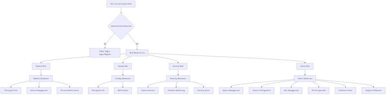
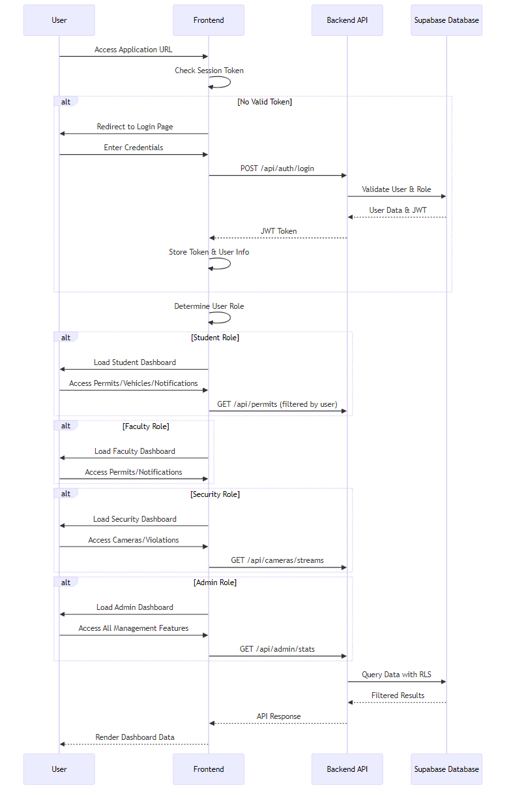

# CPMS Features and Workflows Documentation

## Project Overview
The College Parking Management System (CPMS) is an integrated university-scale solution designed to automate parking operations, enhance security oversight, and provide real-time occupancy data. It combines modern web technologies with advanced computer vision for efficient parking management.

## User Access Diagrams

### User Roles and Access Permissions

### Authentication and Access Flow

## Implemented Features

### 1. AI Security & Monitoring
- **Hybrid Vehicle Detection**: Real-time computer vision system that identifies various vehicle types (cars, motorcycles, buses, trucks) and monitors their movements through facility access points.
- **Cognitive Spatial Reasoning**: Advanced logic capable of identifying vacancies and parking infractions even in outdoor areas without physical parking markings.
- **Virtual Gate Counters**: Automated entry and exit tracking using digital tripwires to maintain accurate real-time counts.

### 2. Permit & Compliance
- **Digital Permit Management**: System for automated permit application submission and administrative review.
- **Dynamic Spot Allocation**: Logic for assigning specific parking zones based on user roles and permit classifications.
- **Automated Violation Logging**: System for automatically detecting and recording parking rule infractions with integrated support for administrative verification.

### 3. Real-time Dashboard
- **Live Occupancy Tracking**: Dashboard interface providing visual representation of filled vs. available parking spots per zone.
- **Integrated Camera Streams**: Centralized interface for viewing live hardware camera feeds and monitoring connection status.
- **Security Notifications**: Instant system-generated alerts for security events, permit status changes, and notifications.

### 4. Enterprise-Grade Security
- **Role-Based Access Control (RBAC)**: Secure, distinct interfaces and feature sets tailored for Administrators, Security personnel, Faculty, and Students.
- **Row-Level Security (RLS)**: Deep database integration ensuring strict data isolation so users can only access their authorized records.

### 5. Backend API Services
- **Authentication & Authorization**: User login, registration, and session management with JWT-based authentication.
- **User Management**: Profile management and user-specific data handling.
- **Camera Management**: Configuration and metadata management for hardware cameras, including RTSP stream processing.
- **ML Integration**: Real-time monitoring of ML pipeline status and detection summaries.
- **Stream Processing**: Logic for live camera feeds and media handling.
- **Permit Management**: Parking authorization and spot allocation logic.
- **Violation Management**: Infraction reporting and management system.

### 6. Frontend User Interfaces
- **Admin Dashboard**: Real-time overview of camera status, parking occupancy, and system health with management tools.
- **Student Interface**: Features for parking permits, vehicle management, and personal notifications.
- **Camera Stream Viewer**: Integrated view for live RTSP stream monitoring.
- **Violation Center**: Table-based interface for auditing and processing infractions.

### 7. Machine Learning Pipeline
- **Object Detection**: Uses YOLOv8 for real-time identification of vehicles and pedestrians.
- **Zone Management**: Utilizes geometric polygons to define parking zones and virtual tripwires for counting.
- **Data Processing**: Supports RTSP streams, local webcams, and static media with preprocessing for optimal detection.
- **Analytics Output**: Generates real-time statistics, annotated snapshots, and performance metrics.

### 8. Database Management
- **User Profiles**: Extended user information with roles and vehicle details.
- **Parking Logs**: Records of vehicle entry and exit events.
- **Permit System**: Management of parking authorizations and spot assignments.
- **Camera Configurations**: Metadata for hardware camera streams and detection logs.
- **Activity Auditing**: Logs of user actions and system events.
- **Support System**: Handling of user inquiries and support requests.

## Workflows

### 1. User Authentication Workflow
1. User accesses the application and navigates to login/register page.
2. User provides credentials or registration details.
3. System validates against Supabase Auth and assigns role-based access.
4. Upon successful authentication, user is redirected to role-specific dashboard.
5. Session is maintained via JWT tokens with automatic logout on expiration.

### 2. Permit Application Workflow
1. Student logs in and accesses the permit application interface.
2. User submits permit request with vehicle details and preferred zone.
3. System validates user eligibility and zone availability.
4. Admin reviews and approves/rejects the application.
5. Upon approval, permit is issued with expiry date and zone assignment.
6. User receives notification of permit status.

### 3. Parking Detection and Monitoring Workflow
1. ML service continuously processes camera streams using YOLOv8 detection.
2. System identifies vehicles and tracks their positions within defined zones.
3. Occupancy counts are calculated and updated in real-time.
4. Detection data is synchronized with the database via backend API.
5. Dashboard displays live occupancy information to authorized users.
6. Security personnel monitor streams and receive alerts for violations.

### 4. Violation Handling Workflow
1. ML system detects parking infractions based on zone rules.
2. Violation is automatically logged with timestamp and details.
3. Admin reviews violation in the violation center interface.
4. If valid, violation is confirmed and user is notified.
5. User can appeal or pay fine through the system.
6. Resolution is tracked and archived for auditing.

### 5. Camera Management Workflow
1. Admin configures camera details including RTSP URLs and locations.
2. System tests camera connectivity and stream quality.
3. ML service integrates camera feeds for processing.
4. Real-time status is monitored and displayed on dashboard.
5. Maintenance alerts are generated for offline cameras.
6. Stream data is processed for detection and stored securely.

### 6. Dashboard Monitoring Workflow
1. User logs in and accesses role-specific dashboard.
2. System fetches real-time data from database and ML services.
3. Occupancy charts, camera feeds, and notifications are displayed.
4. User can interact with controls for specific zones or cameras.
5. Alerts and updates appear instantly via real-time subscriptions.
6. Admin can access management tools for system configuration.

### 7. Support Request Workflow
1. User submits support request through the application interface.
2. Request is logged in the database with priority and category.
3. Admin reviews and assigns support personnel.
4. Communication occurs through integrated messaging system.
5. Resolution is documented and request is closed.
6. User receives confirmation and feedback survey.

## Technical Architecture
- **Frontend**: React 19 with TypeScript, Material UI, Redux Toolkit, React Query.
- **Backend**: Node.js with Express.js, TypeScript, Supabase integration.
- **Database**: PostgreSQL via Supabase with Row-Level Security.
- **ML Pipeline**: Python with YOLOv8, OpenCV, zone-based detection.
- **Deployment**: Vercel for frontend/backend, local services for ML.

This documentation outlines the core features and operational workflows of the CPMS, providing a comprehensive view of the system's capabilities for automated parking management.