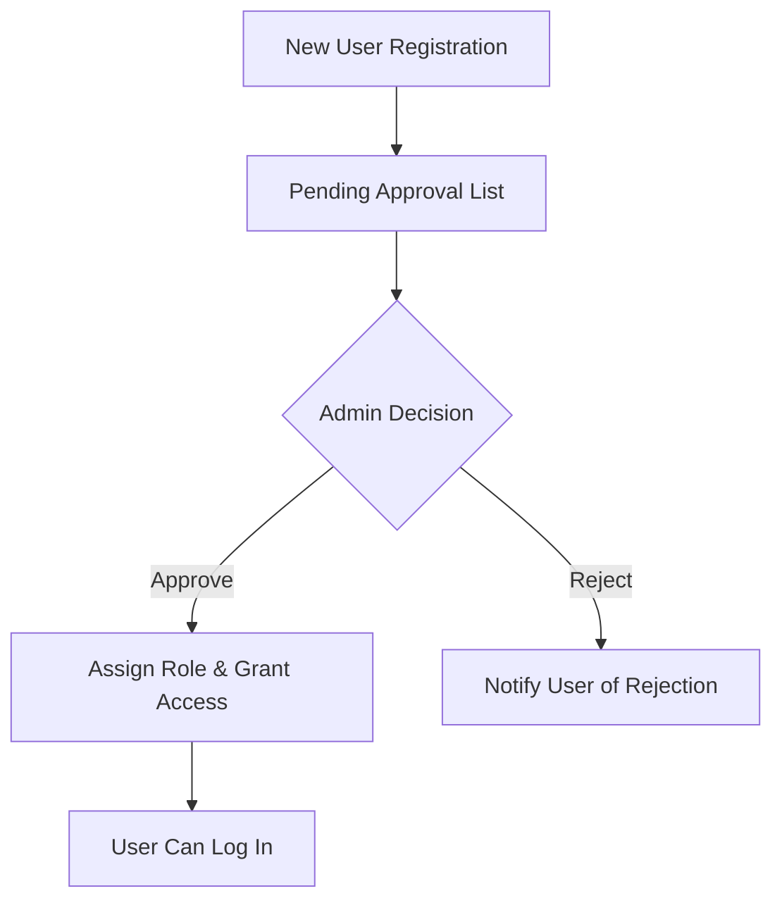
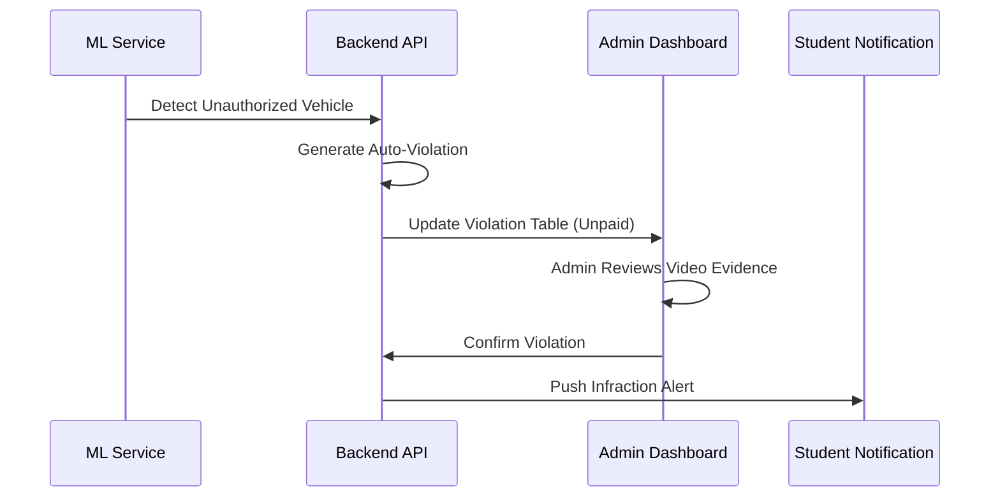

# CPMS User Guide - Administrator Role

## 1. Overview

As an Administrator in the Car Parking Management System (CPMS), you have full oversight and control over the platform's configuration, user management, and security operations.

---

## 2. Key Features

### User & Role Management

- **Signup Approvals**: Review and approve new student and faculty registrations.
- **Role Assignment**: Assign or elevate user permissions (e.g., student to security).
- **User Auditing**: Monitor user activity logs and manage profile data.

### Camera & Stream Control

- **Camera Configuration**: Add, edit, or remove hardware camera streams (RTSP/Webcam).
- **System Health**: Monitor the heartbeat and connection status of all integrated cameras.
- **Media Uploads**: Manually upload video or image data for retroactive AI auditing.

### Operational Management

- **Parking Zones**: Define and edit physical parking zones (Coordinates and Capacities).
- **Permit Processing**: Review permit applications and manage expiry dates.
- **Violation Center**: Track, audit, and process parking rule infractions.

### Analytics & Reporting

- **Live Dashboards**: High-level overview of system occupancy and security alerts.
- **Support Tickets**: Respond to user inquiries and maintenance reports.
- **Data Export**: Generate reports on parking trends and violation statistics.

---

## 3. Administrator Workflows

### User Access Management

How a new user gains access to the system:

### Security Alert & Violation Flow

Automated auditing and administrative response:

---

## 4. System Maintenance

- **ML Monitoring**: Check the health of the AI pipeline to ensure detection accuracy.
- **Database Consistency**: Use the management tools to ensure all records are synchronized correctly.

---

## 5. Conclusion

The Administrator portal provides the necessary tools to maintain safety and efficiency across the campus parking infrastructure, turning real-time detections into actionable security insights.
