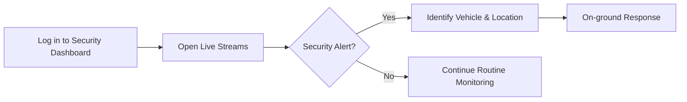
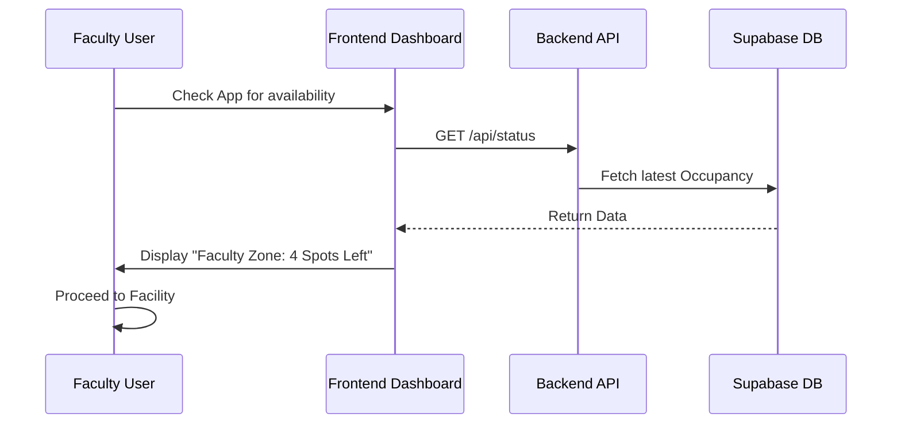

# CPMS User Guide - Security & Faculty Roles

## 1. Overview

The **Security** and **Faculty** roles in the Car Parking Management System (CPMS) are designed for active monitoring and operational awareness. While Security focuses on real-time surveillance, Faculty users have specialized access to monitor campus parking health and their own prioritized parking status.

---

## 2. Key Features

### Real-time Surveillance (Security)

- **Live Stream Access**: Dedicated interface to view all active campus security cameras.
- **Incident Monitoring**: Real-time visualization of vehicle detections, allowing for immediate response to security alerts.
- **Occupancy Heatmap**: Instant awareness of zone saturation to manage traffic flow during events.

### Operational Dashboard (Faculty)

- **Priority Status**: View assigned parking regions and real-time availability in faculty-specific zones.
- **System Health**: Overview of the CPMS network status, ensuring all detection nodes are operational.

### Common Features

- **Notification Inbox**: Receive critical security alerts and system-wide announcements.
- **Parking Overview**: Access the "Status" page to see general campus parking availability at a glance.

---

## 3. Workflows

### Security Monitoring Flow

Typical daily operation for campus security:

### Faculty Parking Awareness

How faculty users utilize the system:

---

## 4. Reporting & Communication

- **Incident Reports**: Security personnel can log incidents via the support ticket system.
- **General Notifications**: Used for communicating campus-wide parking changes or maintenance schedules.

---

## 5. Conclusion

The Security and Faculty portals ensure that key stakeholders have the visibility needed to maintain a safe and organized campus environment. By providing real-time data, CPMS empowers these roles to make informed operational decisions.
