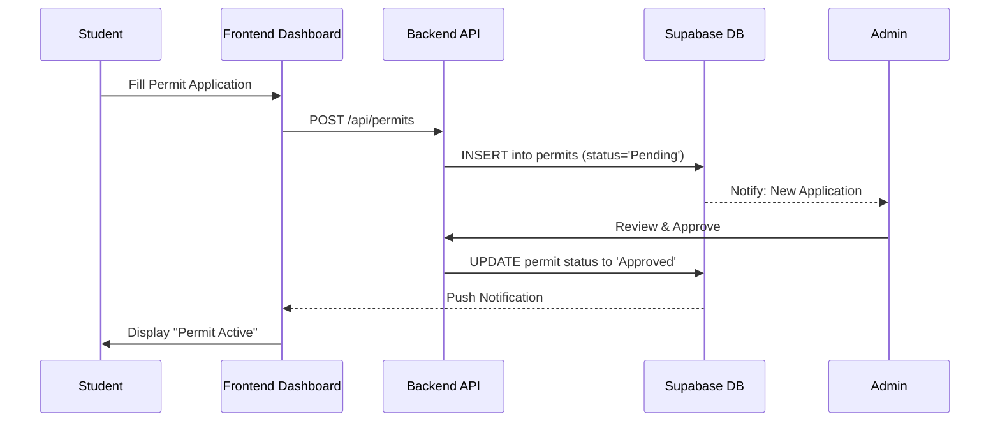
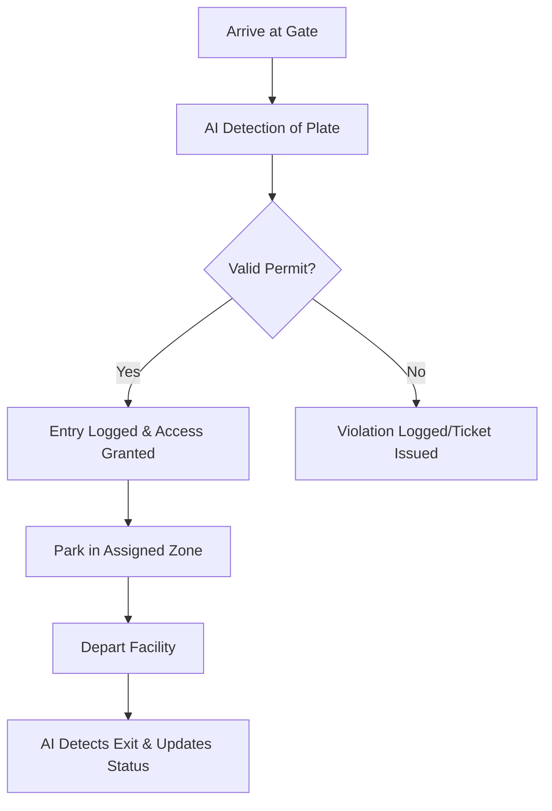

# CPMS User Guide - Student Role

## 1. Overview

As a Student user in the Car Parking Management System (CPMS), your primary interaction involves managing your vehicle details, applying for parking permits, and monitoring your parking status and history.

---

## 2. Key Features

### Profile & Vehicle Management

- **Profile Setup**: View and edit your personal information, including Student ID and contact details.
- **Vehicle Registration**: Register your vehicle's license plate number, make, and model to ensure accurate AI detection.

### Permit Management

- **Apply for Permit**: Submit applications for parking permits in specific campus zones.
- **Status Tracking**: Monitor the live status of your application (Pending, Approved, Rejected).
- **Digital Permit**: View your active permit details, including validity dates and assigned zones.

### Parking & Activity

- **Real-time Status**: Check if your vehicle is currently detected as "In" or "Out" of the facility.
- **Parking History**: View a timestamped log of all your entry and exit events.
- **Notifications**: Receive instant alerts regarding permit approvals, security updates, or potential infractions.

---

## 3. User Workflows

### Permit Application Workflow

This diagram illustrates the process of obtaining a parking permit:

### Daily Parking Flow

The typical interaction when using the facility:

---

## 4. Notifications & Support

- **General Alerts**: System updates and general campus parking news.
- **Security Alerts**: Notifications if your vehicle is detected in an unauthorized zone.
- **Support Tickets**: Directly report issues or ask questions via the "Report" page.

---

## 5. Conclusion

The Student portal is designed to be a self-service hub, reducing the need for manual paperwork and providing transparency into your parking activity.
