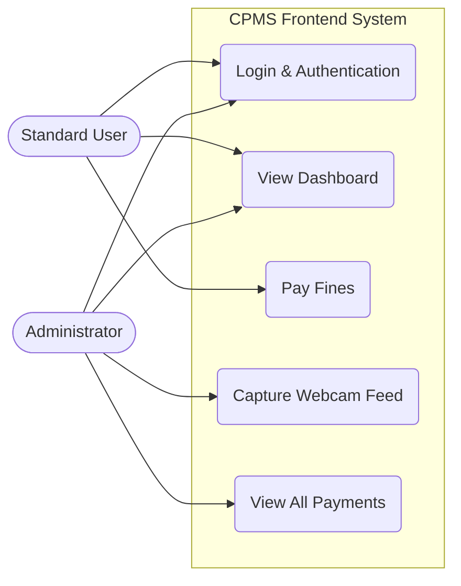
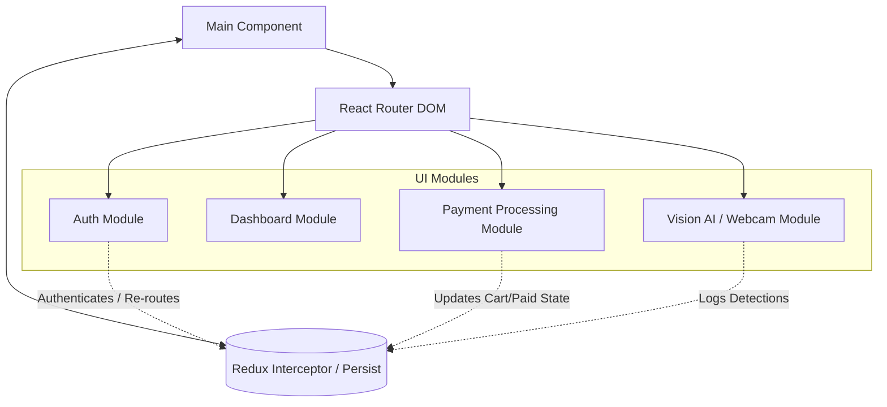
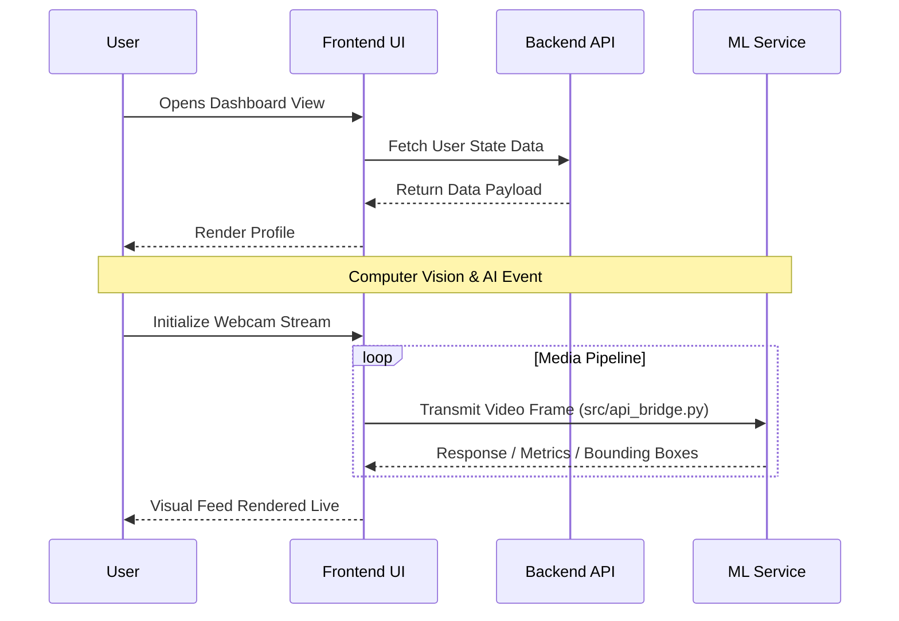

# Frontend Project Documentation
**Project Name**: CPMS Frontend  
**Version**: 0.0.0  
**Date**: April 2026  

---

## 1. Introduction

### 1.1 Purpose
The purpose of this document is to define the software architecture, design, and requirements for the **CPMS Frontend** application. This documentation is intended for developers, architects, and stakeholders to understand the structure, setup, and features of the frontend component.

### 1.2 Scope
The CPMS Frontend is built using modern web technologies to interact with backend services and ML endpoints (Vision AI). It features Role-Based Access Control (RBAC), fine payment systems, and webcam data capture flows. 

### 1.3 Definitions, Acronyms, and Abbreviations
- **IEEE**: Institute of Electrical and Electronics Engineers
- **SRS**: Software Requirements Specification
- **SDD**: Software Design Description
- **CPMS**: Core Project Management System (or related domain context)
- **UI/UX**: User Interface / User Experience
- **RBAC**: Role-Based Access Control

---

## 2. Software Requirements Specification (SRS) - IEEE 830 Inspired

### 2.1 Overall Description
The frontend is a Single Page Application (SPA) designed to provide an interactive and responsive dashboard for users and administrators. It communicates with backend RESTful APIs and machine learning (ML) models.

#### 2.1.1 Use Case Diagram


### 2.2 Functional Requirements
- **FR1 - Authentication & RBAC**: The system must securely authenticate users and enforce Role-Based Access Control to distinguish between typical users and administrators.
- **FR2 - Fine & Payment Management**: The system must allow users to view and settle their fines. It must provide administrators with full access to payment records.
- **FR3 - Webcam Feed Capture**: The system must be capable of capturing video/images via webcam and directly routing this data to the ML backend endpoints via the API bridge.
- **FR4 - Data Visualization**: The system must provide visual representations of data (e.g., charts) for analytical dashboards.
- **FR5 - Internationalization**: The system must support localization using `react-i18next` for multiple languages.

### 2.3 Non-Functional Requirements
- **NFR1 - Performance**: The application must have efficient loading times, utilizing Vite for Fast Hot Module Replacement and TypeScript for code reliability.
- **NFR2 - Responsiveness**: The UI must adapt to various screen sizes seamlessly, utilizing Material-UI grid architectures.
- **NFR3 - Maintainability**: The application must enforce strict coding standards via ESLint and structured TypeScript interfaces.
- **NFR4 - Scalability**: State changes must be managed predictably using Redux Toolkit to ensure the app scales adequately as more features are added.

---

## 3. Software Design Description (SDD) - IEEE 1016 Inspired

### 3.1 Architecture Overview
The frontend architecture follows a component-based structure built with **React 19**. It utilizes a centralized application state via **Redux Toolkit** combined with **Redux Persist** to retain session data across reloads. 

#### 3.1.1 Component Architecture Diagram


### 3.2 Technology Stack
- **Framework**: React 19, TypeScript
- **Build Tool**: Vite 6
- **Routing**: React Router DOM v7
- **State Management**: Redux, Redux Thunk, Reselect
- **UI Components**: Material-UI (MUI v7), Emotion (Styled Components)
- **Form Handling**: React Hook Form, Yup Validation
- **Data Visualization**: Recharts
- **HTTP Client**: Axios
- **External Services**: Supabase (via `@supabase/supabase-js`)

### 3.3 System Entities and Flow
- **Views/Pages (src/app/modules)**: The primary dashboard pages mapping to different domain routes (e.g., Auth, Dashboard, Payments).
- **Global State (src/app/store.ts / appReducer)**: Contains the single source of truth for the active UI state, role permissions, and active fine processing.
- **Services/Utils (src/app/utils)**: Specialized API wrappers or shared configurations supporting API calls or context functions.

#### 3.3.1 Webcam AI Flow Sequence Diagram


### 3.4 Directory Structure
```text
/Frontend
├── /src
│   ├── /app             # Core application functionality
│   │   ├── /Layout      # Reusable layout templates (Sidebar, Header)
│   │   ├── /modules     # Feature modules/pages (Auth, Payments, Vision) 
│   │   ├── /Routes      # Application routing configurations
│   │   ├── /shared      # Shared UI components and logic
│   │   ├── /utils       # Helper functions and hooks
│   │   ├── appReducer.ts# Combined global root reducer
│   │   └── store.ts     # Global Redux Store initialization
│   ├── /assets          # Static assets (images, icons, styles)
│   ├── index.css        # Global CSS setup
│   └── main.tsx         # The main entry point mounting React
├── package.json         # Dependency configuration
├── vite.config.ts       # Vite bundler properties
├── tsconfig.json        # TypeScript configurations
└── eslint.config.js     # Linter rules to enforce code patterns
```

---

## 4. Developer Guide & Setup

### 4.1 Prerequisites
- **Node.js**: Environment ensuring compatibility with ES Modules.
- **npm**: Standard node package management.

### 4.2 Local Setup
1. **Clone the repository** and navigate to the `Frontend` directory:
   ```bash
   cd /path/to/CPMS/Frontend
   ```
2. **Install dependencies**:
   ```bash
   npm install
   ```
3. **Environment Setup**:
   Ensure `.env` matches the required backend/ML bridge URIs and specific Supabase configuration.
4. **Start Development Server**:
   ```bash
   npm run dev
   ```
   The Vite dev server typically starts at `http://localhost:5173`.

### 4.3 Scripts
- `npm run dev`: Starts the local Vite development server with Fast Refresh.
- `npm run build`: Executes strict type-checking (`tsc -b`) and bundles the solution.
- `npm run lint`: Analyzes the `.ts` and `.tsx` source code for stylistic or syntactical problems based on `eslint.config.js`.
- `npm run preview`: Locally mimics the build artifact server.

### 4.4 Development Guidelines
- **Components**: Group by functional modules. Use `/shared` for generic UI components only.
- **Styling**: Leverage `styled-components` connected to `@mui/material/styles` logic. Maintain unified design tokens within MUI themes.
- **Linting & Code Quality**: Submissions must pass the TypeScript compiler constraints and ESLint policies before merging.

---
**Document Sign-off**:  
This document reflects the foundational properties necessary to sustain, scale, and standardize the frontend development workflow for the architecture defined above.
